# Del papel al sistema

## Qué cambió en la operación de AGS Analítica

**Documento de trabajo — Dirección y equipo de soporte · 31 de agosto de 2026**

---

## 1. Resumen

Durante años, la operación de AGS se sostuvo sobre tres piezas: un sistema administrativo
en .NET, un conjunto de planillas de Excel y el criterio de las personas que las usaban.
El trabajo se hacía, y se hacía bien. Los informes salían, los servicios se cerraban y los
controles se ejecutaban.

Lo que no existía era el **registro** de todo eso en un lugar único, consultable y verificable.

Esa es la diferencia que este documento describe. No es que antes no se controlara: es que
el control dependía de que tres personas distintas se acordaran, cada una por su lado, y no
dejaba rastro de haberse hecho. No es que el dato no se tomara: el técnico anotaba las horas
de trabajo y las partes utilizadas en el papel, y ese dato moría ahí, porque nadie lo
transcribía al sistema.

Cinco cambios concentran el resto:

**El registro se crea donde ocurre el trabajo.** El informe de servicio y su protocolo se
completan en la planta, en una tablet, con la firma del cliente tomada en el momento. No hay
transcripción posterior, y por lo tanto no hay posibilidad de que el informe diga algo
distinto de lo que se midió.

**Todo está vinculado con todo.** El ticket sabe qué presupuesto generó; el presupuesto, qué
órdenes de trabajo derivaron de él; la orden, qué materiales consumió, qué remito los llevó y
qué equipo del cliente tocó. Antes cada cosa vivía en su isla y el vínculo era un número
escrito a mano.

**Los estados los cambia el circuito, no una persona.** Antes, el estado de una orden era un
desplegable que alguien elegía y una fecha que alguien tipeaba. Hoy, una orden avanza porque
pasó algo, y el sistema abre solo las tareas que ese avance genera.

**Los documentos dejaron de escanearse.** Fichas, órdenes de trabajo, fotos de préstamos y
órdenes de compra se escaneaban y se renombraban a mano para que el sistema pudiera
encontrarlos. Ese puesto de trabajo —alrededor de tres horas semanales, unas 150 horas al
año— desapareció por completo.

**Los controles se calculan y avisan.** Lo que antes se cruzaba entre la coordinadora y
administración sobre una planilla exportada, hoy se calcula sobre el total de los datos, deja
constancia de haberse hecho, y avisa sin que haya que ir a mirar.

> **Una aclaración necesaria.** Todo lo que sigue compara herramientas, no personas. El
> equipo sostuvo a pulmón, durante años, controles que el sistema no daba. Lo que cambió es
> que hoy esos controles no dependen de que nadie se acuerde.

---

## 2. Antes y después, circuito por circuito

### 2.1 El informe de servicio

Es la piedra angular. Todo lo demás se apoya en esto.

**Cómo se hacía.** El técnico completaba a mano un formulario preimpreso en la planta del
cliente: datos del equipo, síntoma, informe técnico, partes utilizadas, horas de trabajo y de
viaje, y la firma del cliente. Le dejaba una copia en el momento. La copia de AGS volvía a la
oficina, se escaneaba, se renombraba con el número de orden y se archivaba.

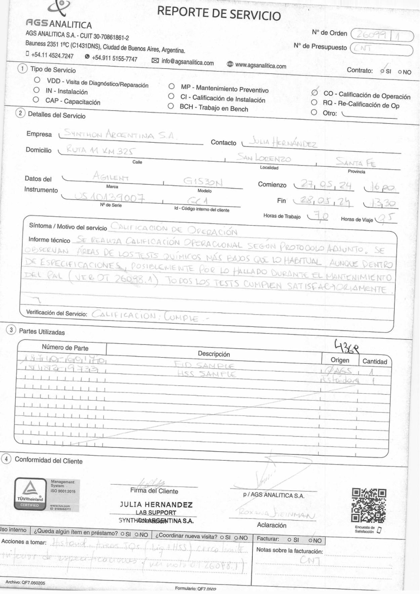

*Informe de servicio, mayo de 2024. Formulario QF7.0502 completado a mano. El número de orden
—arriba a la derecha— también se escribía a mano.*

**Cómo se hace.** El informe se completa en la tablet, en el punto de ejecución. La firma del
cliente se toma en pantalla, las fotos quedan dentro del mismo documento y el PDF se emite y
se envía apenas se cierra el servicio. Funciona sin conexión, que es la condición real de
buena parte de las plantas donde trabajamos.

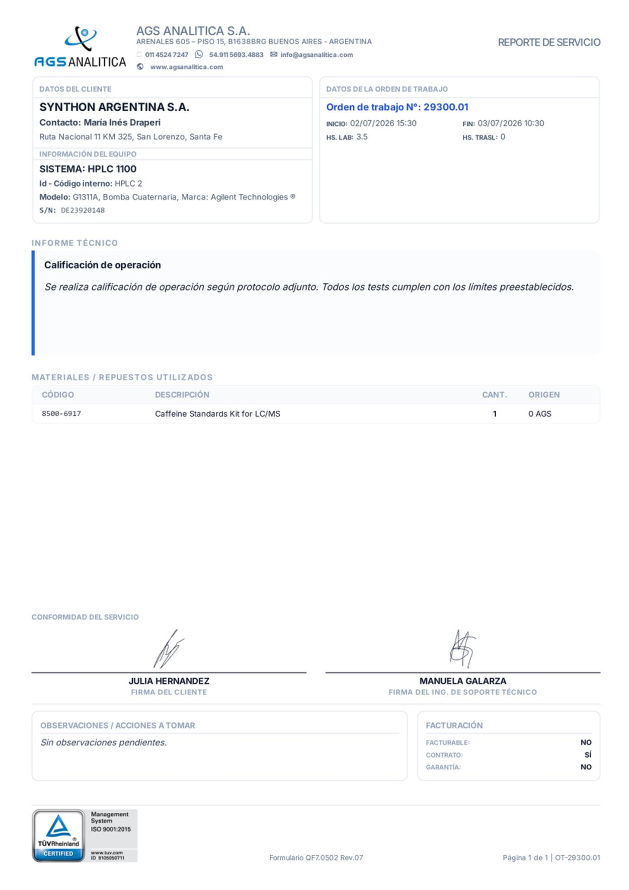

*El mismo cliente, la misma planta y el mismo tipo de servicio, dos años después. Las horas de
laboratorio, el material utilizado y las condiciones de facturación son campos del registro,
no anotaciones.*

**Qué se ganó.**

El cliente siempre tuvo su informe en el momento; eso no cambió y no corresponde presentarlo
como una mejora. Lo que cambió es qué pasaba con el dato después.

En papel, el dato se capturaba **y se perdía**. El formulario de 2024 registra, escritas a
mano, *7,0 horas de trabajo y 2,5 horas de viaje*. En el sistema administrativo, esa orden
—y todas las demás— tiene esos campos en **cero**. Nadie los transcribía. Se pagaba el costo
de tomar el dato y no se obtenía ningún beneficio: no se podía costear un servicio, ni
comparar lo cotizado contra lo real, ni saber cuánto tarda efectivamente un trabajo.

Lo mismo ocurría con las partes utilizadas, anotadas a mano y sin efecto sobre el stock hasta
que alguien las cargaba por separado.

Y hasta que ese papel se escaneaba —hasta una semana más tarde— dentro de AGS no había nada
consultable sobre ese servicio.

Un dato adicional: el informe escaneado es **imagen pura, sin texto**. Un servicio son 24,5
megabytes de páginas en los que no se puede buscar un número de serie, un valor ni un
cliente. El informe que emite hoy el sistema pesa 709 kilobytes, y su contenido es consultable
en la aplicación, porque el PDF es una copia del registro y no el registro mismo.

### 2.2 Los protocolos

**Cómo se hacía.** El protocolo de calificación se imprimía desde un archivo Word, se
completaba a mano en planta, y las celdas no utilizadas se tachaban con una línea. Los
cromatogramas se imprimían del software del equipo y se adjuntaban en papel. Todo eso se
escaneaba junto con el informe.

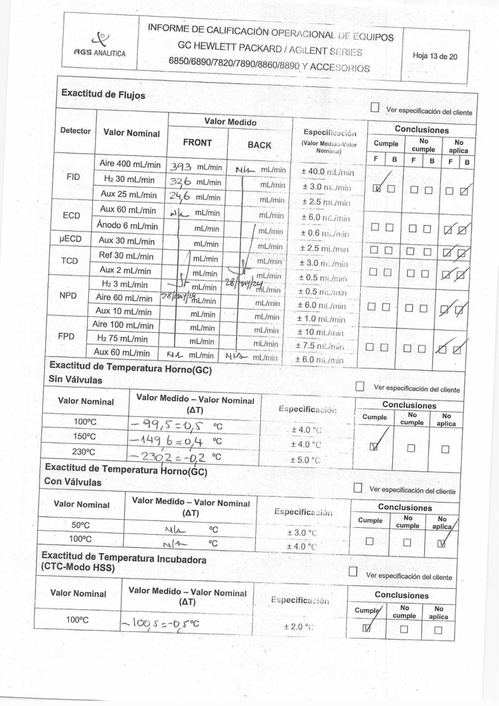

*Hoja 13 de 20 del protocolo de calificación operacional. Valores medidos y conclusiones,
manuscritos.*

**Cómo se hace.** El protocolo se completa en la misma tablet, con su tabla de valores, y se
imprime dentro del mismo PDF que el informe. Las plantillas viven en una biblioteca central y
solo está disponible la versión publicada.

**Qué se ganó.** El control de la versión de la plantilla. El protocolo en papel llevaba su
identificación al pie —formulario QF7.0551, revisión 06, fecha 30/11/2023—, de modo que la
versión estaba controlada en el archivo Word. Lo que no se podía garantizar era que el técnico
hubiera impreso la revisión vigente: quien imprimió una versión anterior, usó una versión
anterior, y nadie se enteraba. Con la biblioteca de tablas eso deja de ser posible, porque la
versión obsoleta no existe para elegir.

Además, el valor se captura una sola vez. Antes se escribía a mano en el protocolo y después
se lo mencionaba en el informe: dos escrituras del mismo número, con dos oportunidades de
divergir.

### 2.3 El pedido del cliente: los tickets

**Cómo se hacía.** El pedido entraba por teléfono o por correo y se convertía directamente en
una orden de trabajo o en un presupuesto. No había una instancia previa donde el pedido
existiera como tal, con responsable y estado. Existía un listado de *Acciones a Tomar* —518
registros— donde el campo de prioridad decía "Sin Asignar" en **todas** las filas.

**Cómo se hace.** El pedido entra como ticket, con área, prioridad y responsable. Se deriva
entre áreas dejando una posta por cada paso, y muestra hace cuánto está esperando.

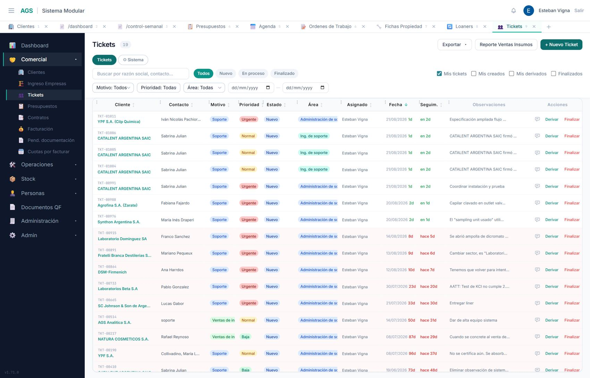

*Bandeja de tickets. Cada fila indica área, responsable, prioridad y antigüedad del último
movimiento.*

**Y una parte que no tiene equivalente en el sistema anterior: los tickets que se abren
solos.** El sistema crea tickets cuando detecta una obligación pendiente, los asigna al
responsable del área que corresponde y los cierra cuando la obligación se cumple. Por ejemplo:

- Un presupuesto que tiene una orden de trabajo vinculada pero **todavía no fue enviado al
  cliente** genera un ticket urgente a Administración de Soporte. Cuando el presupuesto se
  marca como enviado, ese ticket se cierra solo.
- Al aceptarse un presupuesto, se abre el ticket de seguimiento en el área del emisor —ventas
  o administración de soporte, según quién lo hizo—, no en un área fija.
- Cuando llega la orden de compra del cliente, el ticket transiciona solo.
- Un evento de calificación de un proveedor abre su ticket y lo asigna.

**Qué se ganó.** El seguimiento dejó de depender de que alguien recuerde. Antes, un presupuesto
sin enviar era invisible hasta que el cliente llamaba.

### 2.4 El presupuesto: emisión, envío, aceptación y revisión

**Cómo se hacía.** El presupuesto se cargaba en el sistema administrativo, con su clasificación
por tipo y su cotización de moneda tipeada a mano en cada documento. El seguimiento de los
aprobados que esperaban la orden de compra del cliente se llevaba en **otra planilla de
Excel**, con una columna de demora en días.

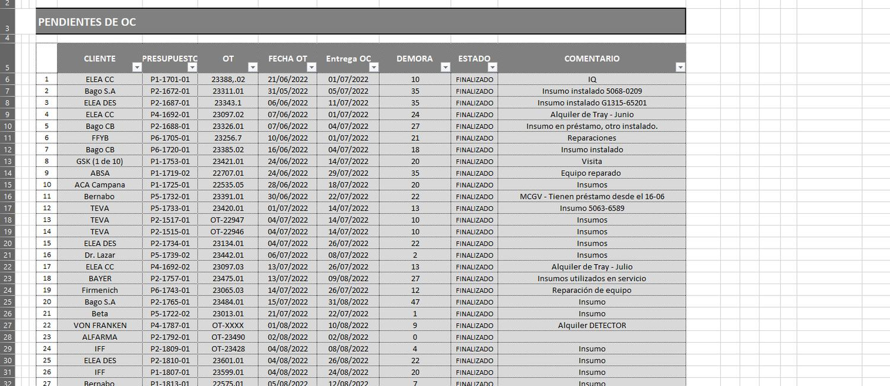

*Seguimiento de presupuestos pendientes de orden de compra, en planilla aparte. La columna
"OT" mezcla formatos —`23388,.02`, `23343.1`, `OT-22947`— y una fila dice `OT-XXXX`.*

**Cómo se hace.** El presupuesto es un registro con ciclo propio y todo su seguimiento en la
misma pantalla.

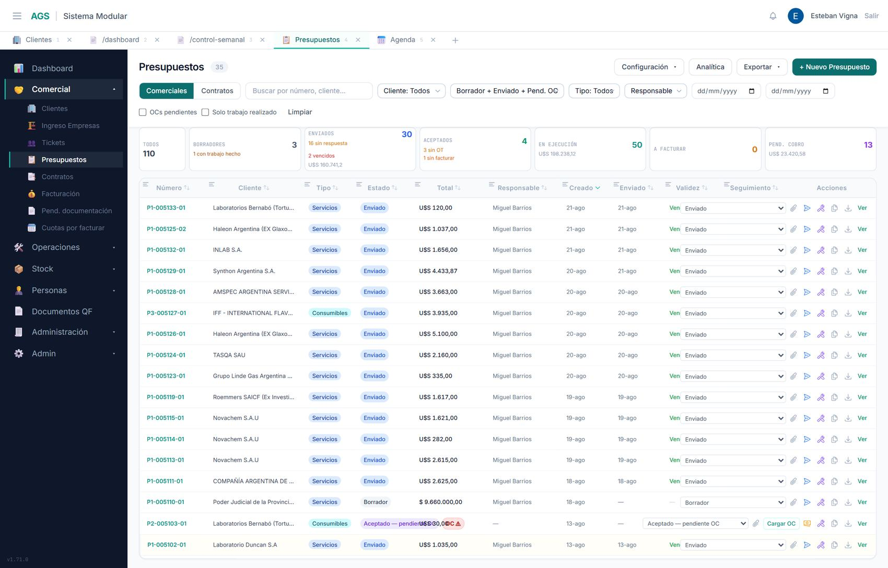

*Listado de presupuestos. Los indicadores de arriba desglosan enviados sin respuesta,
vencidos, aceptados sin orden de trabajo y aceptados sin facturar.*

Lo que el circuito hace hoy:

- **Emisión** con numeración correlativa por categoría, condición de pago, validez y cuotas
  cuando corresponde.
- **Envío** registrado con fecha. Al marcarlo enviado se cierra el recordatorio automático si
  lo había, y se sincroniza el ticket de origen.
- **Validez y vencimiento** calculados: el listado permite aislar los vencidos, y la validez
  desaparece del PDF cuando el presupuesto ya fue aceptado.
- **Aceptación** que dispara el resto: reserva el stock de los ítems, genera los requerimientos
  de compra que hagan falta y abre el ticket de seguimiento.
- **"Aceptado — pendiente de orden de compra"** como estado propio, con la carga de la OC del
  cliente contra el presupuesto.
- **Revisiones**: una revisión conserva el número base y su historial, y puede hacerse incluso
  sobre un presupuesto anulado, que es el caso real cuando el cliente vuelve.
- **Aviso a facturación**, total o parcial, con su propio estado.

**Qué se ganó.** Un solo lugar donde mirar, y un circuito que empuja. Vale reconocer que la
clasificación por tipo de presupuesto y el seguimiento de lo informado a facturación ya
existían en el sistema anterior: no son ideas nuevas, son las mismas ideas sin la planilla
paralela y sin depender de que alguien la actualice.

### 2.5 La orden de trabajo y sus vínculos

**Cómo se hacía.** La orden de trabajo era una ficha con pestañas. El vínculo con lo demás eran
campos de texto: tres cupos fijos de presupuesto (`Presup1`, `Presup2`, `Presup3`), un campo
libre para el número de remito, otro para el comprobante asociado.

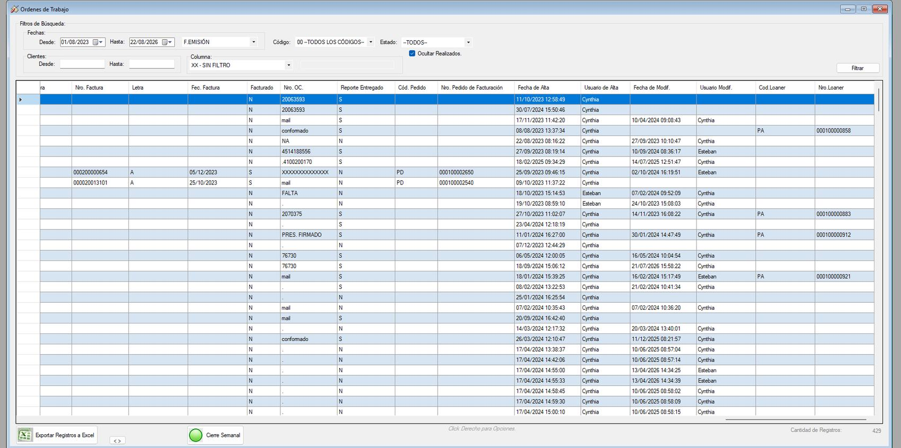

*Columnas del listado anterior. `Nro. Factura`, `Nro. OC`, `Reporte Entregado`, `Fecha de
Alta`, `Usuario Modif.` Obsérvese el contenido del campo de orden de compra.*

**Cómo se hace.** La orden es el centro del circuito y sus vínculos son relaciones, no texto.

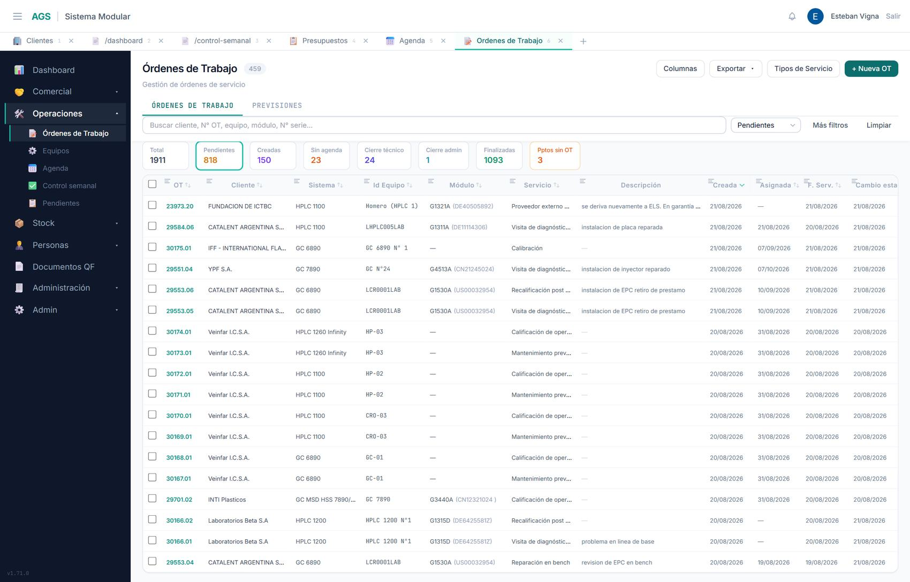

*Listado actual. Los indicadores separan pendientes, creadas, sin agenda, en cierre técnico,
en cierre administrativo y finalizadas.*

Una orden hoy conoce:

- El **presupuesto** o los presupuestos que la originaron, sin tope de cantidad, y en ambos
  sentidos: desde el presupuesto se ven sus órdenes con el estado de cada una.
- El **ticket** del que salió.
- El **contrato** que la cubre, cuando corresponde, y su cupo.
- El **equipo y el módulo** del cliente sobre el que se trabajó.
- Los **materiales consumidos**, que descuentan stock al cerrarse administrativamente.
- Los **remitos** que llevaron esos materiales.
- La **ficha** del equipo, si el trabajo se hizo en nuestro laboratorio.
- El **loaner** entregado en préstamo, si lo hubo.
- El **informe de servicio** emitido, con su PDF.

También distingue los tipos de orden que **no se agendan** —entregas, proveedor externo y
alquiler— y los agrupa en su propia cola, porque no se coordina una visita que no va a
existir: se reclaman.

### 2.6 La agenda

**Cómo se hacía.** En un archivo de Excel llamado *Agenda Anual*: **27 hojas, una por año, de
2006 a 2026**. Cada día ocupaba dos columnas, cada persona una fila, y el contenido de la
celda era texto libre: *"Y-TEC OT- 28946/47"*, *"Lazar OT-28652"*, *"OFICINA"*, *"BENCH
Generadores"*.

**Cómo se hace.** La agenda es parte del sistema: cada celda referencia la orden real.

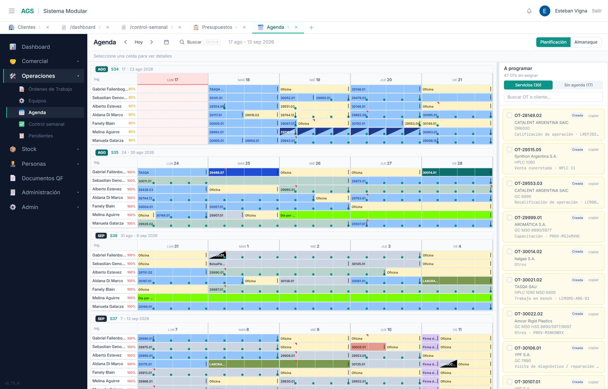

*Agenda semanal. El color se deriva del tipo de tarea y del estado, no se pinta a mano.*

**Qué se ganó.** Tres cosas concretas.

El vínculo con la orden dejó de ser texto. En la planilla, si una orden se reprogramaba, la
celda no se enteraba; si el número se tipeaba mal, la visita quedaba desconectada del trabajo.
Hay celdas con dos órdenes juntas.

El significado dejó de estar en el color. La planilla codificaba en el relleno si era cliente
de zona, del interior, capacitación, oficina, vacaciones o día no laborable. Un archivo así se
puede mirar, pero no consultar, contar ni auditar. Hoy el color se calcula a partir del dato:
es consecuencia, no información.

Y dejó de ser un archivo. Un solo Excel significa una persona por vez, sin control de acceso,
sin saber quién movió una visita ni cuándo, y con veinte años de historia expuestos a una
corrupción de archivo. Como detalle: la planilla arrastra desde el **12 de junio de 2012** un
informe de compatibilidad donde Excel advierte pérdida de funcionalidad. Se siguió usando
trece años igual.

### 2.7 Compras: requerimientos, órdenes a proveedores e importaciones

**Cómo se hacía.** Las **órdenes de compra a proveedores también se hacían en Excel**, y su
seguimiento posterior se llevaba en la planilla de comercio exterior. La necesidad de comprar
—qué falta, cuánto y para cuándo— se proyectaba en otras planillas: una para insumos de GC,
otra para HPLC, otra para insumos especiales, otra para lámparas.

**Cómo se hace.** El circuito de compra es una cadena de registros:

- **Requerimiento de compra**: nace de un presupuesto aceptado o cuando un artículo cae por
  debajo de su stock mínimo. Sabe para qué cliente y contra qué presupuesto es, y distingue lo
  que se compra para un cliente de lo que se compra para reponer.
- **Orden de compra al proveedor**: se arma desde los requerimientos, con su numeración, su
  PDF y su estado.
- **Recepción**: el ingreso a stock se hace contra la orden de compra, con las presentaciones
  y los envases en que efectivamente viene la mercadería.
- **Importaciones**: el embarque tiene sus gastos, su costeo y su factor. Como el stock entra
  apenas llega la mercadería —con facturas todavía en camino—, ese primer costo es estimado;
  cuando llegan las facturas reales se confirma el costeo definitivo y el valor se estampa en
  las unidades, incluidas las que ya salieron. El estimado se conserva, porque explica con qué
  número se cotizó mientras el real no existía.

**Qué se ganó.** La necesidad, la compra, la recepción y el costo dejaron de ser cuatro
planillas y pasaron a ser un mismo hilo. Y la disponibilidad se calcula: el sistema distingue
lo que hay, lo que está reservado, lo que está en tránsito y lo que está comprometido.

### 2.8 Stock: reserva, asignación y consumo

Conviene ser justo: **el stock no era un punto débil del sistema anterior.** Tenía tipos de
movimiento —alta, transferencia, remito, devolución, ajuste, consumo contra orden de trabajo—,
reportes a fecha y bajo mínimo, y una comparación de composición de minikits contra
existencias.

El problema estaba en el puente. El técnico anotaba las partes utilizadas a mano en el
formulario, y **alguien** tenía que cargar después ese consumo en el sistema de stock. Dos
registros del mismo hecho, unidos por una persona.

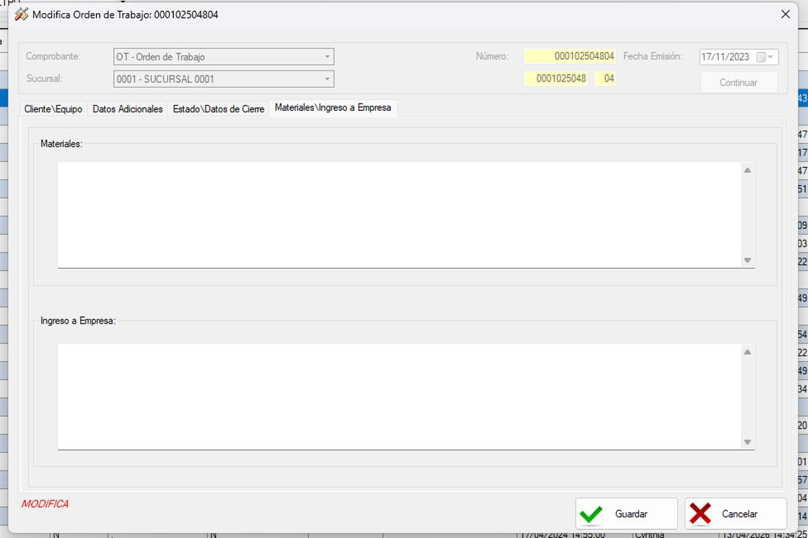

*La pestaña "Materiales / Ingreso a Empresa" de una orden de trabajo: dos cajas de texto libre.*

**Lo que se agregó.** Además de eliminar ese puente, el circuito de stock incorporó la
**reserva**, que antes no existía:

- Cuando se acepta un presupuesto, las unidades de sus ítems quedan **reservadas** para ese
  presupuesto y se mueven a una posición propia. Dejan de contarse como disponibles para otro
  trabajo, pero **siguen siendo operables**: se le pueden asignar a un ingeniero, salir por
  remito y consumirse contra la orden, sin dejar de estar ligadas al presupuesto que las
  reservó.
- Si el presupuesto se anula, la reserva se libera sola.
- Las **asignaciones** a cada ingeniero registran qué se llevó, con qué remito salió y qué
  volvió.
- El **consumo** se produce al cierre administrativo de la orden, no antes: hasta ese momento
  la pieza salió, pero no se gastó.

### 2.9 Asignaciones y remitos

**Cómo se hacía.** El remito existía como movimiento de stock, y en la orden de trabajo había
un campo de texto libre llamado `Nro. de Remitos`. En los registros reales ese campo está
**vacío en todas las filas**: el remito se emitía, pero la orden no lo sabía. Lo que un
ingeniero se llevaba en el auto no estaba registrado en ningún lado; se sabía cuando volvía, o
cuando no volvía.

**Cómo se hace.** Son dos piezas encadenadas.

La **asignación** registra qué unidades se le entregan a un ingeniero para un trabajo: de qué
posición salieron, contra qué orden y qué presupuesto, y qué volvió. Una unidad asignada deja
de estar disponible sin dejar de existir: se sabe dónde está y con quién.

El **remito** es el papel de esa salida, y el sistema distingue dos clases:

- **Remito interno**, entre posiciones nuestras o hacia un ingeniero. Documenta un movimiento
  dentro de la casa.
- **Remito externo**, al cliente o al proveedor, con destinatario, transportista y datos de
  transporte, impreso sobre el talonario preimpreso.

Y distingue dos clases de línea, que es lo que importa de verdad:

- **Entrega**: la unidad se va y no vuelve. Al cerrarse la orden se convierte en consumo.
- **Sale y vuelve**: la unidad sale en préstamo o para un trabajo y tiene que regresar. Queda
  pendiente de retorno hasta que vuelve, y el sistema sabe a qué posición devolverla.

El remito conoce la orden de trabajo, el presupuesto, las asignaciones que agrupa y la firma
del receptor. Se puede anular, y la anulación devuelve cada unidad a la posición de la que
salió. Un remito de servicio se cierra con el cierre administrativo de la orden; uno de
entrega, con la conformidad del cliente.

**Qué se ganó.** Que la pregunta "¿dónde está esta pieza?" tenga una respuesta. Antes, entre
que salía del depósito y volvía —o se consumía—, la unidad desaparecía del sistema y vivía en
la memoria del ingeniero que la tenía.

### 2.10 Entregas: el visor de cumplimiento

Este módulo no tiene equivalente en el sistema anterior.

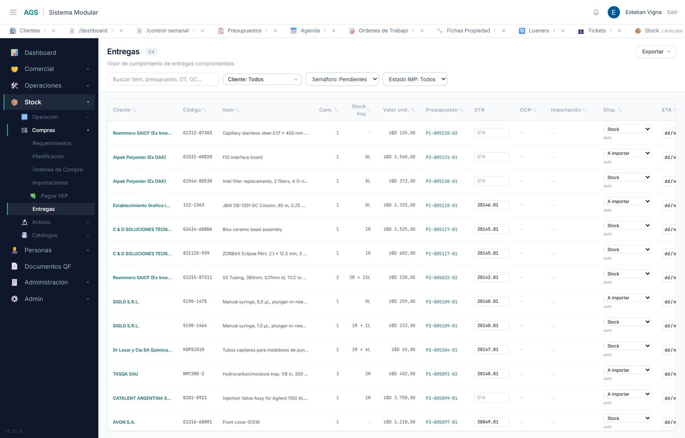

*Visor de cumplimiento de entregas comprometidas, con semáforo y fecha estimada.*

Reúne todo lo que AGS se comprometió a entregar y todavía no entregó, y para cada ítem muestra
de dónde va a salir: si hay stock hoy, si hay que importarlo, contra qué presupuesto y qué
orden de compra, y con qué fecha estimada.

Antes, esa pregunta —"¿qué le debemos a los clientes y cuándo se lo podemos dar?"— se
contestaba consultando cuatro planillas y la memoria de dos personas.

### 2.11 El equipo del cliente en nuestro laboratorio

**Cómo se hacía.** Existía la *Ficha Propiedad Cliente*, con el equipo, el contacto y un campo
de detalle. Admitía como máximo cuatro ítems. La derivación a un tercero se registraba
escribiéndola en el campo de comentario: *"Derivar a ELS"*, *"Se deriva source lens"*, *"se
deriva bomba a Jorge"*. **El retorno no se registraba en ningún lado.**

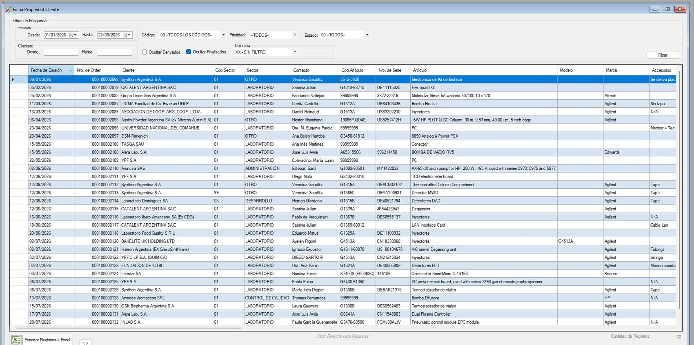

*Listado de fichas anterior. Varias filas usan el código de artículo comodín `99999999`, con
el equipo descrito a mano.*

**Cómo se hace.** La ficha tiene un ciclo de estados explícito y sin tope de ítems.

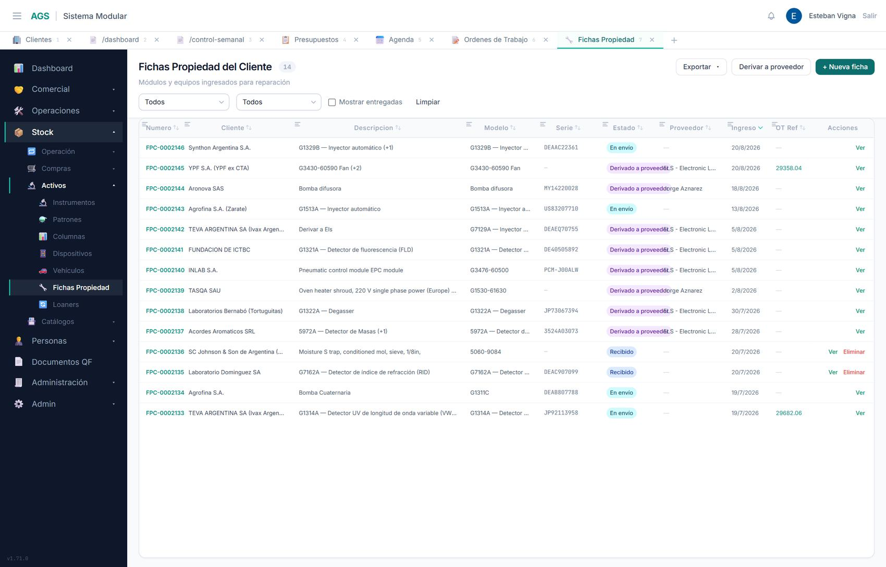

*Fichas activas con su estado: recibido, derivada a proveedor, en envío. La columna "OT Ref."
enlaza la orden de trabajo asociada.*

El equipo recorre: recibido, en diagnóstico, en reparación, derivado a proveedor, esperando
repuesto, listo para entregar, en envío, entregado. La derivación a un proveedor es un
registro con su fecha de salida **y su fecha de retorno**, no una frase. La ficha conoce su
orden de trabajo, sus fotos, sus documentos y el loaner que se dejó en su lugar.

**Por qué importa más de lo que parece.** Ese equipo no es nuestro. Es propiedad del cliente,
y mientras está en nuestro poder —o en el de un tercero al que se lo derivamos— tenemos que
poder decir dónde está y desde cuándo. Con el modelo anterior, la salida quedaba en un
comentario y el regreso no quedaba en ningún lado.

### 2.12 Los equipos de préstamo

**Cómo se hacía.** El listado de loaners tenía dos estados: **DISPONIBLE** y **NO
DISPONIBLE**, resaltados con color amarillo, y una columna de comentario general donde vivía
la historia: *"Placa Madre vendida a Brenntag"*, *"Revisado por RS 26/07/2023 - OK"*. Había un
detalle de préstamos por número de serie, que funcionaba.

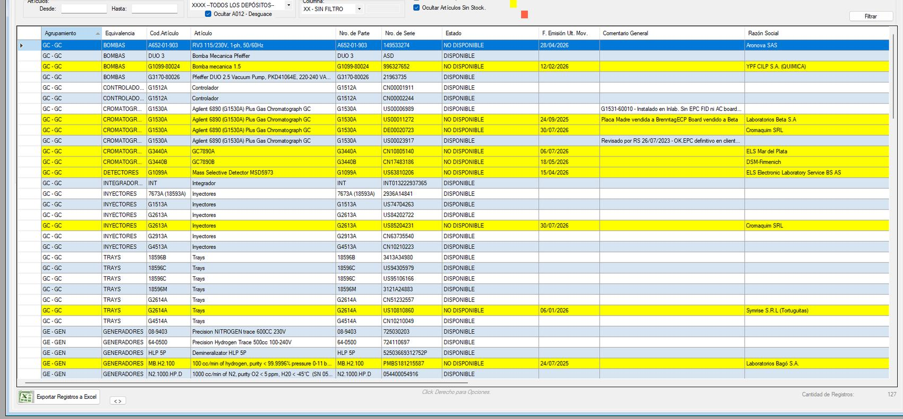

*Loaners en el sistema anterior. El estado es binario y el resto de la información vive en el
comentario.*

**Cómo se hace.**

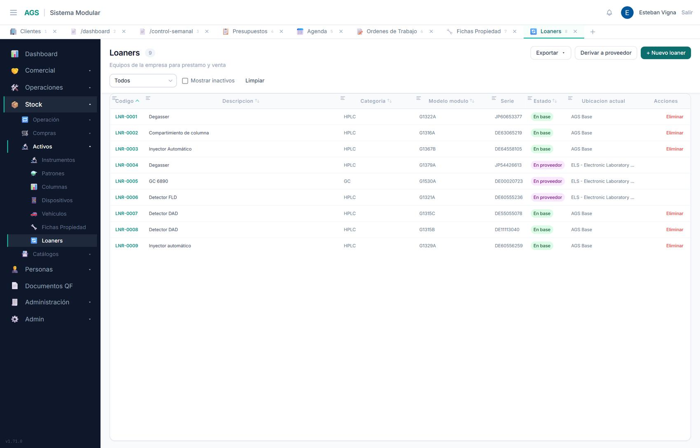

*Cada loaner con su categoría, modelo, serie, estado y ubicación actual.*

El loaner tiene ubicación real —en base, en un cliente, en un proveedor—, su historial de
préstamos con la orden de trabajo asociada, sus fotos, su remito de salida y de devolución.
Se le pueden **extraer partes**, que ingresan al stock como usadas y quedan registradas como
faltantes hasta reponerse, de modo que un loaner incompleto se sabe incompleto. Y puede
venderse, con su circuito propio.

### 2.13 Cierre, facturación y cobranza

**Cómo se hacía.** El pase a facturación era una casilla —*A Facturar: SI/NO*— y un cuadro de
texto libre al lado. En los registros reales ese cuadro contiene cosas como *"PEND
REPARACION"*, *"garantía"* y, textualmente, *"garantia?"* con signo de pregunta: una decisión
pendiente registrada como duda.

**Cómo se hace.** El cierre técnico y el cierre administrativo son dos momentos distintos y
registrados. El aviso a facturación es un estado, admite avisos parciales, y arrastra la
condición de pago y las cuotas cuando corresponde. Del otro lado, el control de facturas
permite registrar el número de factura real y seguir la cobranza.

### 2.14 Los controles y los avisos

**Cómo se hacía.** El sistema administrativo tenía un botón llamado *Cierre Semanal* que no
ejecutaba ningún control: fijaba los filtros para listar las órdenes asignadas y exportarlas a
Excel. El control lo hacían las personas. La coordinadora revisaba las órdenes agendadas sin
cerrar y las entregas pendientes; el cruce con administración verificaba que lo pasado a
facturar efectivamente se hubiera facturado.

Ese Excel es el archivo *Cierre Semanal Vigente*: **149 megabytes, 235 pestañas, una por
semana, desde julio de 2021**.

**Cómo se hace.**

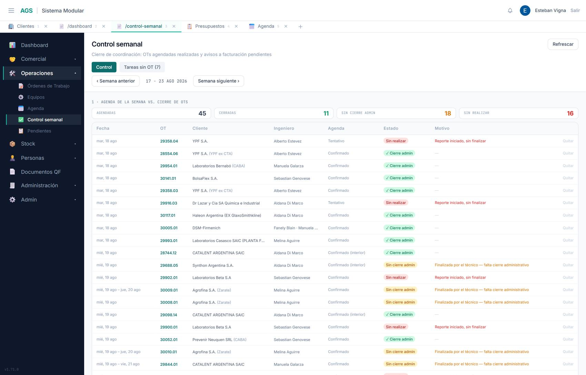

*Control semanal. Para la semana seleccionada: agendadas, cerradas, sin cierre administrativo
y sin realizar, con el motivo de cada pendiente y el botón para quitar lo que no corresponde.*

El control semanal recorre la semana y muestra, con su motivo, cada orden agendada que no se
cerró, cada cierre técnico al que le falta el administrativo, cada presupuesto aceptado sin
orden de trabajo y cada aviso a facturación pendiente. Tiene además una pestaña de tareas de
agenda que no tienen orden asociada.

**Y los avisos.** El control es algo que uno va a mirar; el aviso viene a buscarlo a uno. Hoy
el sistema avisa:

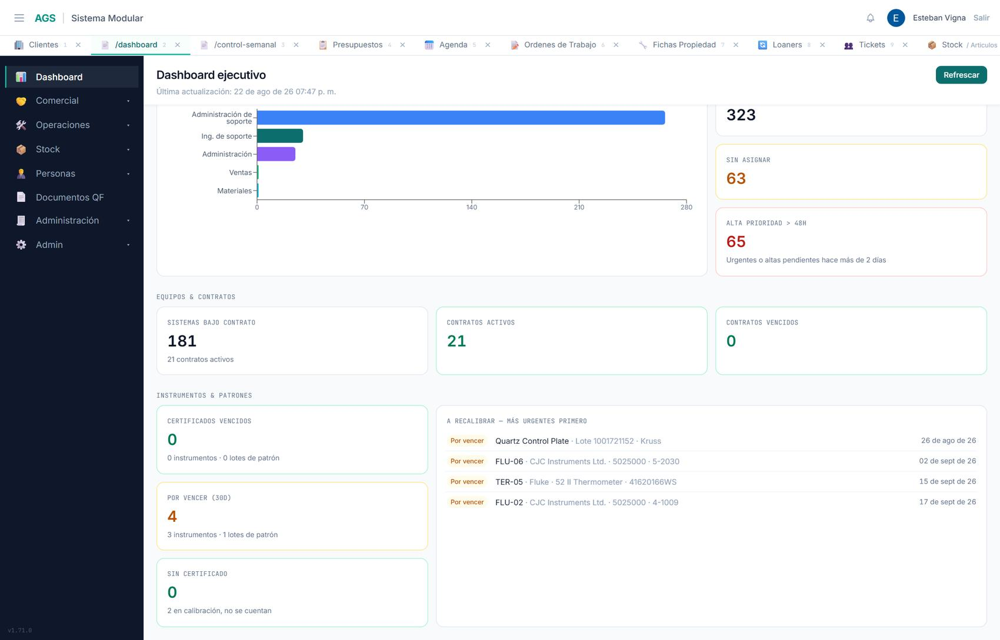

*Panel de vencimientos en la pantalla principal: certificados vencidos, próximos a vencer a 30
días y sin certificado, con el detalle ordenado por urgencia.*

- **Vencimiento de certificados** de instrumentos y de lotes de patrones, con los más urgentes
  primero. Los instrumentos que ya están afuera calibrándose se muestran aparte, porque son una
  acción en curso y no una pendiente.
- **Contratos por vencer** a 60 días.
- **Stock bajo mínimo**, que genera el requerimiento de compra.
- **Tickets de alta prioridad** con más de 48 horas sin movimiento.
- Y los **tickets automáticos** descritos en 2.3, que son la forma más directa de aviso: en
  lugar de una alerta que alguien tiene que ver, aparece una tarea asignada a una persona.

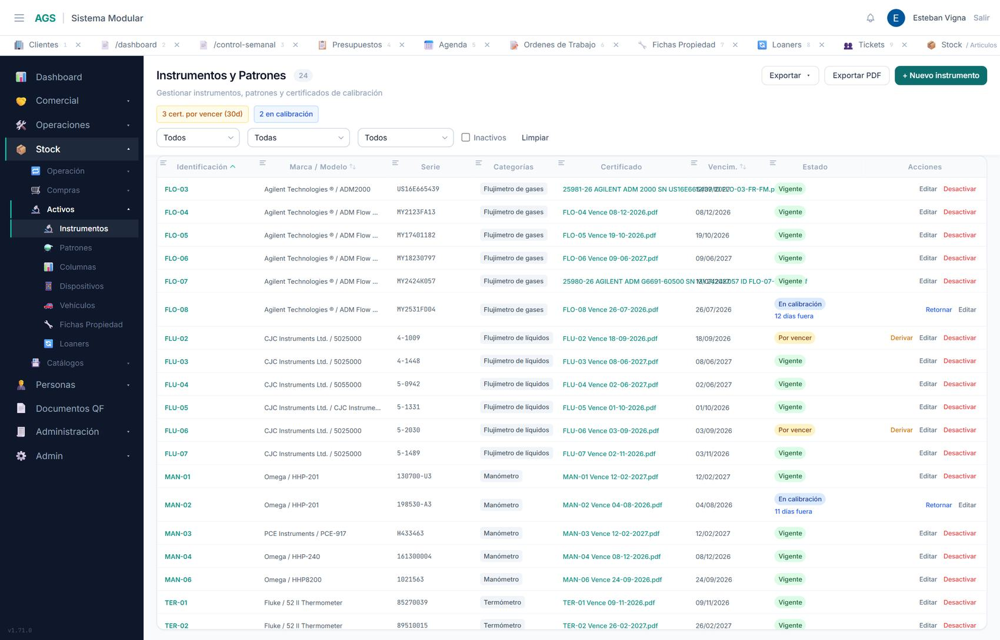

*Listado de instrumentos con su certificado, vencimiento y estado. Los certificados se guardan
contra el instrumento, con su historial de recalibraciones.*

**Qué se ganó.** Tres cosas que conviene separar.

**Evidencia.** En la planilla quedó registrado *qué se listó* cada semana. Nunca qué se
revisó, qué se resolvió ni qué quedó abierto.

**Cadencia.** De las 235 pestañas, **36 abarcan más de una semana** —hay una que va del 24 de
febrero al 21 de marzo, otra del 24 de marzo al 16 de abril—. Cada una es un período en el que
el control semanal no fue semanal, y quedó registrado en el nombre de la pestaña.

**Independencia de las personas.** Eran tres revisiones separadas; ninguna convergía en un solo
lugar, y si alguna de esas personas no estaba, esa parte del control no se hacía.

---

## 3. El sistema paralelo: diez planillas

Las secciones anteriores mencionan planillas de Excel una y otra vez. Conviene verlas juntas,
porque el conjunto dice más que cada una por separado.

| Planilla | Hojas | Tamaño | Para qué |
|---|---|---|---|
| Cierre Semanal Vigente | 235 | 149 MB | Control semanal, una hoja por semana desde julio 2021 |
| Agenda Anual | 27 | 8,0 MB | Planificación de personas, una hoja por año desde 2006 |
| Nuevo Seguimiento Comex | 14 | 1,5 MB | Costeo de importaciones, saldos, factores |
| Reportes CM | 10 | 111 KB | Proveedores, préstamos, bench, viajes por año |
| Planificación Insumos especiales | 9 | 170 KB | Proyección de consumo a cuatro meses |
| Planificación Insumos HPLC | 8 | 116 KB | Ídem, para HPLC |
| Planificación Lámparas | 2 | 54 KB | Recambio de lámparas |
| Planificación Muestras | 2 | 16 KB | Muestras |
| Métricas Compras | 1 | 337 KB | Compras al exterior |
| Planificación Insumos GC | 1 | 14 KB | Proyección de consumo, GC |
| **Total** | **309** | **≈156 MB** | |

A eso se suman las **órdenes de compra a proveedores**, que también se armaban en Excel, y la
planilla de *Pendientes de OC* para seguir los presupuestos aprobados.

Tres observaciones sobre este conjunto.

**Ninguna de estas planillas era un capricho.** Cada una resuelve algo que el sistema
administrativo no hacía. Son la respuesta razonable de gente competente a una herramienta
insuficiente.

**El patrón es siempre el mismo: se arrastran.** *Planificación Insumos HPLC* tiene ocho hojas
—"Sep-Diciembre", "Oct-Ene", "Nov-Mar", y así— porque cada mes alguien copia la hoja y corre la
ventana cuatro meses. *Insumos especiales* tiene nueve por el mismo motivo. El cierre semanal,
235. La agenda, 27. Nadie decidió nunca que esos archivos crecieran así: crecieron porque no
había otro lugar donde poner la versión nueva sin perder la anterior.

Ese arrastre tiene un efecto secundario. En *Insumos HPLC*, la hoja llamada "Mayo - Agosto"
contiene en realidad el período que va del 1 de agosto al 1 de octubre de 2026. El nombre quedó
del ciclo anterior.

**Y contienen lógica de negocio real.** La proyección de insumos calcula existencia final como
existencia inicial más ingresos menos consumos proyectados: la fórmula está escrita como título
de columna, `Ef=Eo+I-Cp`. Es un cálculo de necesidades de material, hecho a mano y sin ninguna
validación. El seguimiento de comercio exterior tiene dos hojas llamadas "Calculador" y
"Calculador 2". La planificación de viajes registra las fechas como texto: junto a "2 al 4/2"
conviven "MARZO", "JUNIO" y "JULIO".

**Qué se ganó.** Cinco de estas diez planillas ya no se usan, porque su función está en el
sistema: el control semanal, la agenda, el seguimiento de pendientes de orden de compra, el de
préstamos y el de equipos en bench. Las de proyección de insumos y costeo de importaciones
están en curso.

---

## 4. Lo que antes no se podía saber

Un sistema no vale por lo que muestra, sino por las preguntas que permite contestar. Estas no
se podían contestar antes, no por falta de voluntad sino porque el dato no estaba en ningún
lado consultable:

| Pregunta | Antes | Hoy |
|---|---|---|
| ¿Cuántas horas reales llevó este servicio? | En el papel, sin consolidar | En el registro |
| ¿Cuánto tardamos desde que entra el pedido hasta que se cierra? | No medible | Medible |
| ¿Qué se consumió en este equipo a lo largo del año? | Disperso | Consultable |
| ¿Qué órdenes quedaron abiertas y desde cuándo? | Revisión manual | Pantalla |
| ¿Qué presupuestos se aceptaron y no derivaron en trabajo? | No se miraba | Control semanal |
| ¿Qué le debemos entregar a cada cliente y cuándo? | Cuatro planillas | Visor de entregas |
| ¿Qué equipos de clientes tenemos hoy en nuestro laboratorio? | Planilla y memoria | Ficha con ciclo |
| ¿Cuándo volvió un equipo derivado a un proveedor? | **No se registraba** | Fecha de retorno |
| ¿Este loaner está completo? | Comentario libre | Partes faltantes |
| ¿Quién modificó este registro y cuándo? | Última modificación | Historial |

---

## 5. Integridad del dato: tres ejemplos

Los siguientes son registros reales del sistema anterior. No son casos extremos elegidos a
propósito: aparecen a simple vista en el listado.

**El campo de orden de compra del cliente.** Es un campo de texto libre. Junto a números de
orden de compra legítimos convive lo siguiente: `mail`, `conformado`, `NA`, `FALTA`,
`PRES. FIRMADO`, `XXXXXXXXXXXXXX`, y varias celdas con un punto.

**Un contrato vigente entre 2009 y 2099.** Con número de contrato `XX`. Alguien necesitó
avanzar y el sistema no lo impidió.

**Equipos que no existen como registro.** El código `99999999` funcionaba como comodín: cuando
el equipo del cliente no estaba dado de alta, se escribía su descripción a mano. Aparecen así
*"UV 8453"*, *"Placa FLF (Ex GSK)"*, *"Trampas para purgar"*. Sin registro del equipo no hay
historial del equipo, y sin historial no hay nada que mostrarle al cliente sobre su flota.

En los tres casos el patrón es el mismo: **el sistema aceptaba cualquier cosa**, y la calidad
del dato quedaba librada al cuidado de cada persona.

---

## 6. Qué mira una auditoría bajo ISO 9001

AGS está certificada bajo ISO 9001:2015 por TÜV Rheinland y se audita todos los años. Esta
sección no pretende ser exhaustiva: señala dónde los cambios descritos tocan requisitos que la
norma evalúa.

| Requisito | Cómo se cubría antes | Cómo se cubre hoy |
|---|---|---|
| Información documentada (7.5) | Formularios controlados en papel y Word; el vínculo documento–registro era el nombre del archivo escaneado | Registro digital único; plantillas de protocolo solo en su versión publicada |
| Trazabilidad del registro | Usuario y fecha de alta y de última modificación | Historial de cambios, no solo la última |
| Propiedad del cliente (8.5.3) | Derivación a terceros en un comentario; retorno sin registrar | Ciclo de estados de la ficha con fecha de retorno |
| Control de proveedores externos (8.4) | Evaluación periódica manual | Módulo de calificación con eventos registrados |
| Recursos de seguimiento y medición (7.1.5) | Estado del certificado visible en cada listado | Ídem, más aviso de vencimientos en pantalla principal |
| Control operacional (8.5.1) | Control ejecutado por personas, sin evidencia | Control semanal calculado, con registro |
| Competencia (7.2) | Matriz de competencias en planilla | Sin cambios — decisión deliberada, ver abajo |

**Sobre la observación del año pasado.** La auditoría anterior observó la ausencia de avisos de
vencimiento de patrones e instrumentos. El estado del certificado ya se calculaba y se mostraba
en los listados de ambos; lo que faltaba era el aviso: había que entrar al módulo y acordarse de
mirar. Se incorporó el panel de vencimientos de la pantalla principal, que reúne instrumentos y
lotes de patrones, diferencia vencidos de próximos a vencer y lleva al listado correspondiente.

**Sobre la matriz de competencias.** Se mantiene en planilla, actualizada. Su digitalización
está prevista y no es prioritaria: el registro cumple su función y el criterio de qué ingeniero
está habilitado para cada intervención está definido y documentado.

---

## 7. Lo que viene: los portales externos

Todo lo anterior mira hacia adentro. El próximo paso mira hacia afuera, y por dos motivos
distintos que conviene separar.

### El portal del cliente

El cliente entra y ve su propia flota: cada equipo con su historial de servicios, los informes
descargables, y —lo más valioso— **el estado en vivo del equipo que está en nuestro
laboratorio**: recibido, en diagnóstico, en reparación, derivado a proveedor, esperando
repuesto, listo para entregar, en camino. Con el equipo de préstamo asociado y la fecha
estimada. Desde ahí también puede solicitar un servicio.

*Por qué importa comercialmente:* deja de haber una llamada para preguntar cómo viene un equipo.
El cliente se atiende solo, con mejor información de la que le daríamos por teléfono.

*Por qué importa para la calidad:* es la contracara del requisito de propiedad del cliente. No
solo registramos la custodia del equipo: se la informamos al dueño sin que la tenga que pedir.

### El portal de proveedores

El requerimiento asignado le aparece al proveedor, carga su cotización, se arma la orden de
compra y él mismo informa la fecha de entrega.

*Por qué importa comercialmente:* acorta el ciclo de compra y elimina la cadena de correos.

*Por qué importa para la calidad:* genera, sin trabajo adicional, los datos objetivos de
desempeño que la evaluación de proveedores necesita — cuánto tarda en cotizar, si cumplió la
fecha que él mismo comprometió. Es la diferencia entre evaluar proveedores con una planilla que
se completa de memoria una vez al año y hacerlo con el registro de lo que efectivamente pasó.

### Estado real y qué falta

Corresponde ser preciso, porque esto todavía no está abierto:

- Las dos aplicaciones existen y funcionan. El acceso con usuario y contraseña real está
  operativo.
- Del lado de proveedores, las reglas de seguridad y los permisos por proveedor **están
  publicados en producción**.
- Las pantallas todavía funcionan sobre **datos de ejemplo**.
- Del lado del cliente, las reglas de acceso están escritas y probadas, pero **sin publicar**.
- Quedan dos accesos por cerrar antes de conectar datos reales: el informe de servicio es hoy de
  lectura pública y el almacenamiento de reportes no está acotado por cliente.

**En consecuencia, se puede mostrar el prototipo funcionando, pero no se debe abrir con datos de
un cliente real hasta cerrar esos dos puntos.** Es una decisión tomada, no una omisión: no se
abre una puerta al exterior antes de saber exactamente quién puede ver qué.

---

*Documento preparado para la reunión del 31 de agosto de 2026. Una versión ampliada de la
sección 6 se preparará para la auditoría de fines de septiembre.*
